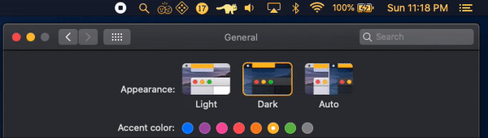

# ColorMenu
 
 

# Information:

- Designed for macOS 10.14+
- ColorMenu is a [MacForge](https://github.com/w0lfschild/MacForge) plugin that makes your Statusbar Items match the system accent color.
- Author: [w0lfschild](https://github.com/w0lfschild)

# Installation:

1. Download [MacForge](https://github.com/w0lfschild/app_updates/raw/master/MacForge/MacForge.zip)
2. Install [ColorMenu](https://www.macenhance.com/mflink?macforge://github.com/w0lfschild/myRepo/raw/master/mytweaks/com.macenhance.ColorMenuItems)
